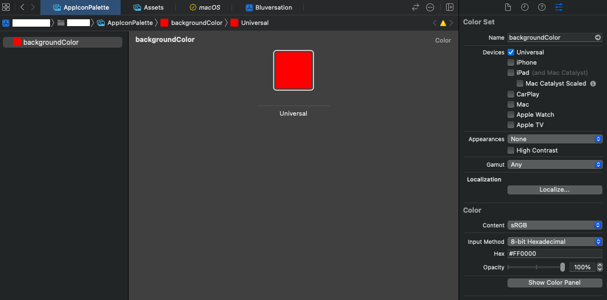
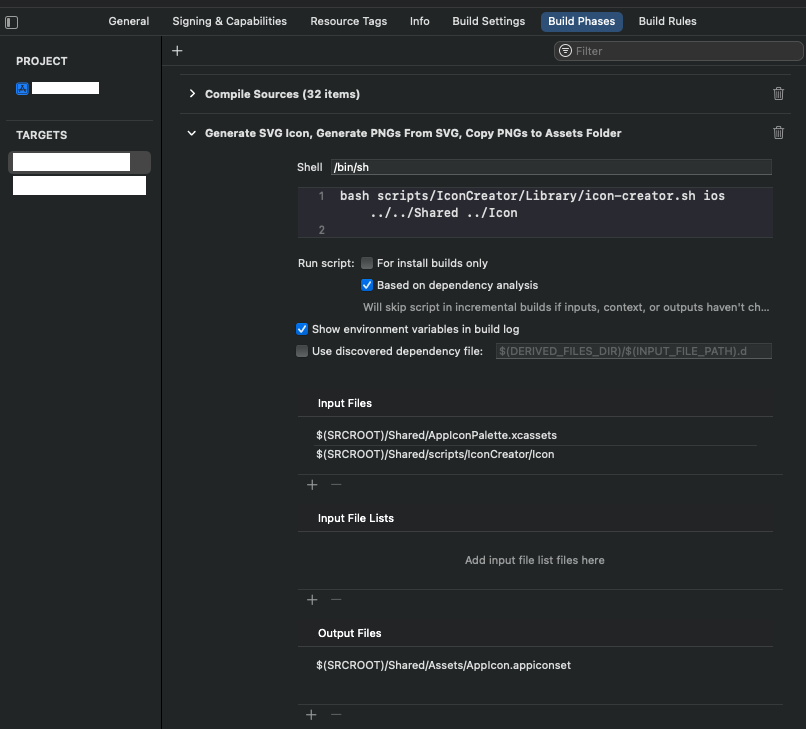

<h1 align="center">
  Icon Creator
</h1>

<p align="center">
  <strong>Create the icon of your application using Swift</strong><br>
  Use Swift to craft an icon, which will then be converted into SVG format. The process automatically generates all required sizes and seamlessly integrates them into your project. Moreover, you have the flexibility to define the icon colors using those specified in your asset file.
</p>

- [Instalation](#instalation)
- [Usage](#getting-started)
  - [Android](#android)
  - [iOS](#ios)
- [Examples](#examples)

## Instalation

- At the root of your project, run this command in Terminal: 

```bash
git submodule add git@github.com:giovanischiar/icon-creator.git scripts/IconCreator/Library/
```

- This will create a git submodule within your application. After completing all steps, commit the `.gitmodules` file and the folder created to store the library's code files, `scripts/IconCreator/Library`

## Usage

- Navigate to `scripts/IconCreator` and create a folder named `Icon`
- Inside the `Icon` folder, create a class called `Dimensions`.

```
class Dimensions {
    let iconSize = 108.0 // This will be the size of the application icon.
}

```

- Create one struct file for the foreground and another for the background of the icon.

```swift
struct IconBackground: Backgroundable {
    let dimensions = Traits.shared.dimensions
    var size: Double { dimensions.iconSize }

    var background: Background {
        Background(size: size).fill(color: -"backgroundColor")
    }
}

```

```swift
struct IconForeground: Foregroundable {
    let dimensions = Traits.shared.dimensions
    var size: Double { dimensions.iconSize }

    var foreground: Foreground {
        Foreground(size: size) {
            Div {

            }
            .position(x: 0, y: 0)
            .dimension(width: 50, height: 50)
            .stroke(color:  "#000000")
            .stroke(width: 2)
        }
    }
}

```
The foreground struct conforms to the `Backgroundable` protocol, and the background conforms to the `Foregroundable` protocol. You can create the icon using the `VectorUI` declarative code, which was created by me and is already included in this library. It's inspired by [SwiftUI](https://developer.apple.com/xcode/swiftui/).

### Android

- Create an `iconpalette.xml` file inside the `app/src/main/res` directory.

```xml
<?xml version="1.0" encoding="utf-8"?>
<resources>
  <color name="backgroundColor">#FFFFFF</color>
  <!-- You can add as many colors as you want, so you can use them in your icon files. -->
</resources>
``` 

Note that the color name `backgroundColor` must be the same as the color inside the Icon files for the library to get the correct color.

- Create a task in your `app/build.gradle`

```kotlin
task(name = "generateIcons", type = Exec::class) {
    dependsOn("mergeDebugResources")
    inputs.file("src/main/res/values/iconpalette.xml") // The path to your `iconpalette.xml` file.
    inputs.dir("../scripts/IconCreator/Icon") // The path to your `Icon` folder.
    outputs.file("src/main/res/drawable/ic_launcher_background.xml") // The path to your generated adaptive icon background file.
    outputs.file("src/main/res/drawable-v24/ic_launcher_foreground.xml") // The path to your generated adaptive icon foreground file.
    project.exec {
        commandLine = listOf("bash", "../scripts/IconCreator/Library/icon-creator.sh", "android", "../..", "../Icon", "scaled")
    }
}
```

```groovy
android {
    afterEvaluate {
        packageDebugResources.dependsOn 'generateIcons'
    }
}

task generateIcons(type: Exec) {
    dependsOn "mergeDebugResources"
    dependsOn "mapDebugSourceSetPaths"
    dependsOn "mapReleaseSourceSetPaths"
    dependsOn "mergeReleaseResources"
    dependsOn "packageReleaseResources"
    inputs.file 'src/main/res/values/iconpalette.xml' // The path to your `iconpalette.xml` file.
    inputs.dir '../scripts/IconCreator/Icon' // The path to your `Icon` folder.
    outputs.file 'src/main/res/drawable/ic_launcher_background.xml' // The path to your generated adaptive icon background file.
    outputs.file 'src/main/res/drawable-v24/ic_launcher_foreground.xml' // The path to your generated adaptive icon foreground file.
    commandLine 'bash', '../scripts/IconCreator/Library/icon-creator.sh', 'android', '../..', '../Icon'
}
```

This will execute the command line bash `../scripts/IconCreator/Library/icon-creator.sh android ../.. ../Icon`, where:
  - `bash` indicates to execute the bash script.
  - `../scripts/IconCreator/Library/icon-creator.sh` is the path to the library's bash script from `app/build.gradle`.
  - `../..` indicates the relative path from the `Library` folder to the root path of the project.
  - `../Icon` indicates the relative path from the `Library` folder to the Icon folder.
    Proceed to `Build > Rebuild Project` or simply run the application.

### iOS

- Add a new asset named `AppIconPalette`:
  - Right-click on the Project in Xcode and select `New File...`.
  - Scroll until you find the `Resource` tab and click on `Asset Catalog`.
  - Enter the name AppIconPalette and proceed. This file needs to be in the same directory as the Assets that contain the application name.
- Right-click on the screen of the asset and select `New Color Set`.
- Rename it to backgroundColor. Any other colors used in the icon folder's icons can be created here.
- Open the `Inspector` button located at the top right:
  - Click on the `Any Appearance` square. You can change the color on the last tab in the `Color` tab.
  - Change the `Input Method` to `8-bit Hexadecimal`.
  - The page will look like this:
<br>
- Click on the Application name, go to the `Build Phases` tab.
- Click on the `+` icon at the top right. Click on `New Run Script Phase`. You can rename it to `Generate SVG Icon, Generate PNGs From SVG, Copy PNGs to Assets Folder`.
- Click and drag it to be below `Compile Sources`
- Below Shell, paste this code: `bash scripts/IconCreator/Library/icon-creator.sh ios ../../<app-name> ../Icon`
  - `bash` indicates to execute the bash script.
  - `../scripts/IconCreator/Library/icon-creator.sh` is the path to the library bash script from `app/build.gradle`
  - `../../<assets-path>` indicates the relative path from the `Library` folder to the root path of the project.
  - Replace `<assets-path>` with the path to the folders `Assets.xcassets` and `AppIconPalette.xcassets`. The `Assets.xcassets` file contains the application icon. Typically, it is inside the `Shared` folder or the folder with the name of your application.
  - `../Icon` indicates the relative path from the `Library` folder to the `Icon` folder.
- In `Input Files`, add:
  - `$(SRCROOT)/<assets-path>/AppIconPalette.xcassets`
  - `$(SRCROOT)/<assets-path>/scripts/IconCreator/Icon`
- In `Output Files`, add:
  - `$(SRCROOT)/<app-name>/Assets/AppIcon.appiconset`
- The Script configuration will look like this:
<br>
- Replace `<assets-path>` with the path to the folders `Assets.xcassets` and `AppIconPalette.xcassets`.
- Run Product > Build or hit ⌘ + B.

## Examples

You can see examples of using the library and creating icons using `VectorUI` in my own projects [Fridgnet](https://github.com/giovanischiar/fridgnet) and [Rule of 3](https://github.com/giovanischiar/rule-of-three-wearos) for Android, as well as (https://github.com/giovanischiar/rule-of-three-ios) for iOS.

